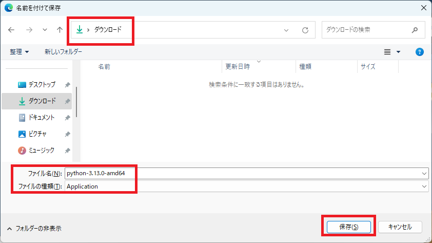
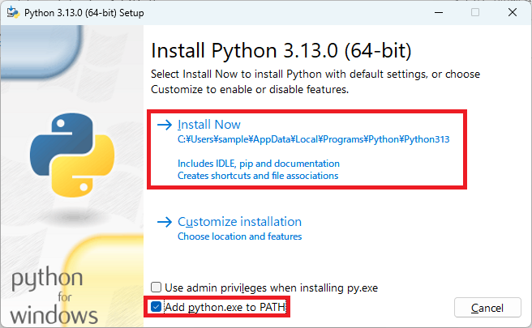
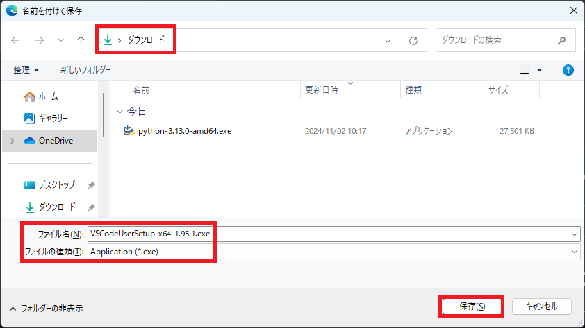
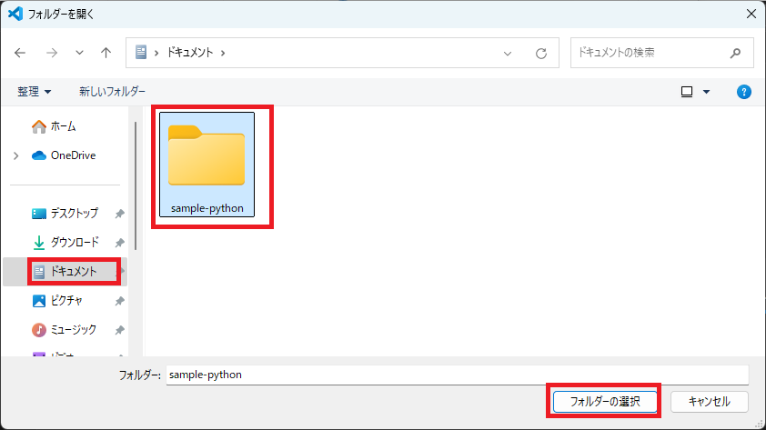
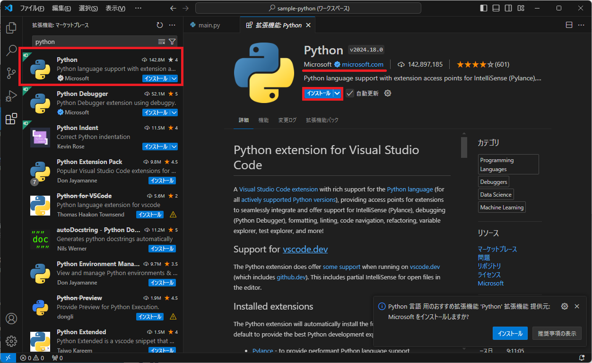
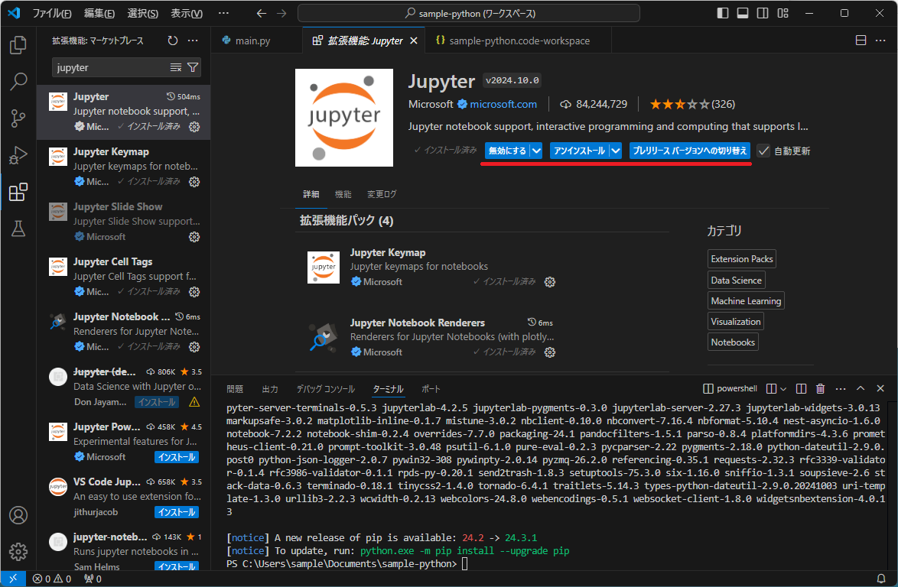
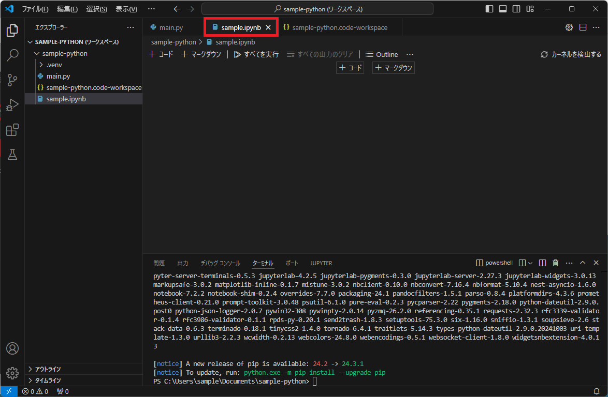

---
html:
  embed_local_images: true
  embed_svg: true
  offline: true
  toc: true
export_on_save:
  html: true
---

# VSCode + Python環境構築

<!-- @import "[TOC]" {cmd="toc" depthFrom=1 depthTo=6 orderedList=false} -->

<!-- code_chunk_output -->

- [VSCode + Python環境構築](#vscode--python環境構築)
  - [凡例](#凡例)
  - [Python - インストール](#python---インストール)
    - [Python - バージョン](#python---バージョン)
    - [Python - インストーラの入手](#python---インストーラの入手)
    - [Python - インストーラの実行](#python---インストーラの実行)
    - [Python - インストールの確認 - パターン1](#python---インストールの確認---パターン1)
    - [Python - インストールの確認 - パターン2](#python---インストールの確認---パターン2)
  - [VSCode - インストール](#vscode---インストール)
    - [VSCode - インストーラの入手](#vscode---インストーラの入手)
    - [VSCode - インストーラの実行](#vscode---インストーラの実行)
  - [VSCode - 補足](#vscode---補足)
    - [VSCode - 拡張機能](#vscode---拡張機能)
    - [VSCode - ワークスペース](#vscode---ワークスペース)
    - [VSCode - 日本語化](#vscode---日本語化)
    - [VSCode - シンプルな環境の作成](#vscode---シンプルな環境の作成)
      - [ワークスペース作成](#ワークスペース作成)
      - [ワークスペースを開く](#ワークスペースを開く)
  - [VSCodeでのPython開発 - 基本](#vscodeでのpython開発---基本)
    - [Pythonスクリプト実行 - 拡張機能を利用しない](#pythonスクリプト実行---拡張機能を利用しない)
    - [Pythonスクリプト実行 - 拡張機能を利用する](#pythonスクリプト実行---拡張機能を利用する)
      - [拡張機能のインストール - ユーザ単位](#拡張機能のインストール---ユーザ単位)
      - [拡張機能のインストール - ワークスペース単位](#拡張機能のインストール---ワークスペース単位)
      - [拡張機能のインストール - ワークスペース単位 - 確認](#拡張機能のインストール---ワークスペース単位---確認)
      - [拡張機能によるPythonスクリプトの実行](#拡張機能によるpythonスクリプトの実行)
  - [Python - 補足](#python---補足)
    - [Python - ライブラリ](#python---ライブラリ)
    - [Python - 仮想環境](#python---仮想環境)
      - [仮想環境の必要性](#仮想環境の必要性)
      - [仮想環境の種類](#仮想環境の種類)
      - [仮想環境の作成](#仮想環境の作成)
      - [仮想環境にライブラリ追加](#仮想環境にライブラリ追加)
      - [インストールしたライブラリ確認](#インストールしたライブラリ確認)
  - [VSCodeでのPython開発 - 仮想環境利用](#vscodeでのpython開発---仮想環境利用)
    - [Python仮想環境へJupyterをインストール](#python仮想環境へjupyterをインストール)
    - [VSCodeへ「Jupyter」を追加](#vscodeへjupyterを追加)
    - [JupyterによるPythonスクリプトの実行](#jupyterによるpythonスクリプトの実行)

<!-- /code_chunk_output -->

## 凡例

本書内での記述例を示す。

:::tip
知っておくと便利な小技系
:::

:::info
知っておいた方がよさそうな情報
:::

:::note
おまけ的なメモ・自分語り
:::

:::warning
極めてリスクの高い事例
:::

:::caution
注意深く利用する必要のある事例
:::

:::sample
コマンドやコードのサンプル等
:::

## Python - インストール

以下順序でPythonのインストールを進める。  

1. 利用するバージョンについて
1. インストーラの入手
1. インストーラの実行
1. インストールできたことの確認

### Python - バージョン

Pythonには大まかに2.n系と3.n系が存在する。  
どちらを利用することもありうるが、本書では最新のPython環境を利用する。  
それぞれの主な特徴は下図の通り。  

:::info
Pythonには派生形が多数存在する。  
・Circuit Python  
・Micro Python  
・Iron Python  
・etc.  
これらと区別するためにPython.orgからダウンロードできるPythonをCPythonと呼称することもある。
:::

:::note
筆者が現在利用しているメイン機では2.7, 3.7～3.11をインストールしている。  
このため、利用するバージョンを使い分ける手段が必要になる。  
バージョンを使い分ける手段は後述する。  
:::

### Python - インストーラの入手

以下Python.orgのページからインストーラをダウンロードする。  
[https://www.python.org/](https://www.python.org/)

Downloadsをクリックする。

{.image_w900}

トップには最新バージョンが表示されるハズなのでクリックする。

{.image_w900}

ブラウザのダウンローダに従って、名前を付けて保存する。

{.image_w900}

適当なフォルダへ保存する。  
下図は一例として「ダウンロード」フォルダへ、デフォルトのファイル名で保存している。  

{.image_w900}

### Python - インストーラの実行

公式のインストール手順は以下にある。  
[https://docs.python.org/ja/3/using/windows.html](https://docs.python.org/ja/3/using/windows.html)

:::note
Pythonは敷居の低さ故に粗製乱造されたネット記事が多いうえ、昨今は生成AIの影響で粗悪さに拍車がかかっている。  
困ったことがあれば最初に公式ドキュメントを参照すること。  
ただし、公式ドキュメントは厳密すぎることで逆に分かり難いことがあるので、ネット記事と行ったり来たりしながら正解を考えることも多分にありうる。  
:::

ダウンロードしたインストーラをダブルクリックする。

{.image_w900}

「Add python.exe to PATH」のチェックボックスを有効にしてから、「Install Now」をクリックする。  

{.image_w900}

:::info
「Add python.exe to PATH」とは。  
Windowsの環境変数PATHにPythonのインストールディレクトリを追加することを意味する。  
環境変数PATHに追加されたプログラムは、どのディレクトリからでも、フルパスを指定せずに実行できるようになる。  
このチェックボックスを有効にすることで、以下が同義になる。
・コマンドプロンプト上で「python」と入力する
・コマンドプロンプト上で「Python.exe」のフルパスを入力する
:::

:::Caution
環境変数PATHとは。  
Windowsがプログラムを探す際のディレクトリパスが登録されている。  
今回のようにインストーラが追加してくれる場合もあれば、ユーザが能動的に追加することも出来る。  
環境変数PATHへ追加しておけば、フルパスを毎回入力する手間が省けるので、作業効率が上がる。  
**乱用は厳禁。**  
システム全体に影響するため、乱用すると環境同士が衝突しうる可能性がある。  
一般ユーザが編集することはあまり想定されておらず、問題が生じた場合の原因も特定しにくい。  
機能をよく理解したうえで、本当に必要なディレクトリのみ登録すること。  
:::

:::info
「Use admin privileges when installing py.exe」とは。  
py.exeというpythonを管理するランチャーのインストール時に管理者権限を利用するか否か。  
PC内の全ユーザへインストールする場合に、管理者権限が必要となる。  
今回は全ユーザへインストールしないので、チェックボックスを有効にしない。
:::

インストールが開始されるので、完了するまで数分待機する。  

{.image_w900}

インストール完了後、「Disable path length limit」が表示された場合はクリックする。  

{.image_w900}

:::info
「Disable path length limit」とは。  
※ Windows側の設定なので、過去に設定済みの場合は本オプションは表示されない。  
昔のWindowsは、パスの長さが260文字に制限されていたため、261文字以上のパスは解決できずエラーになる。  
今のWindowsは、約32,000文字まで制限を緩和でき、その設定を有効化するのが本オプションである。  
これにより、Pythonにおける open()や osモジュール等、パスを扱うほとんどの機能で260文字より長いパスを利用できるようになる。
:::

:::note
無効のままでもいいが、有効化しておくことを推奨する。  
雑にPythonスクリプトを組むと、実行環境までのパス＋ログファイル名で260文字を超える状況は容易に発生する。  
:::

「Disable path length limit」をクリックした場合、Windows側の設定を変更することになる。  
ユーザアカウント制御が表示されるので、「はい」をクリックする。  

{.image_w900}

上記設定の更新後、もしくは最初から「Disable path length limit」が表示されていない場合は、以下表示となる。  
「Close」をクリックしてインストール作業は終わり。  

{.image_w900}

### Python - インストールの確認 - パターン1

まず、コマンドプロンプトを起動する。  
Windowsキー と Rキー を同時押しすることで、「ファイル名を指定して実行」ウィンドウが表示される。  
「cmd」と入力して Enterキーを押下する。  

{.image_w900}

ホームディレクトリを表示した状態のコマンドプロンプトが起動する。  

{.image_w900}

「python」と入力して Enterキーを押下し、以下表示になればPythonのインストールに成功している。  

{.image_w900}

:::info
">>> "の待ち受け状態は、いわゆる対話モードを示す。
行単位で処理を実行できるので、ごく簡単な動作確認程度ならこの状態で試すことも可能。  
:::

試しに以下コマンド入力すれば`Hello World!`が出力され、問題なく動作することが分かる。  

:::sample
print('Hello World!')
:::

{.image_w900}

実行中は変数も保持するので、以下のような演算を行うことも可能である。  

:::sample
a = 1 + 2  
b = 10 + 20  
print(a + b)
:::

{.image_w900}

対話モードを終了するには以下コマンドを実行する。  

:::sample
quit()
:::

{.image_w900}

### Python - インストールの確認 - パターン2

インストール手順の途中で登場した「py.exe」を利用することでもインストール状態の確認ができる。  
以下コマンドを利用すると、インストール済みのPythonを一覧表示できる。  
一覧に今回インストールしたバージョンが表示されれば、インストールに成功している。  

:::sample
py --list
:::

{.image_w900}

## VSCode - インストール

以下順序でVSCodeのインストールを進める。  

1. インストーラの入手
1. インストーラの実行
1. インストールできたことの確認

### VSCode - インストーラの入手

以下公式ページからインストーラをダウンロードする。  
[https://code.visualstudio.com/](https://code.visualstudio.com/)

Download for Windowsをクリックする。

{.image_w900}

画面遷移後、待機しているとダウンロードが始まるのでブラウザのダウンローダに従って、名前を付けて保存する。

{.image_w900}

適当なフォルダへ保存する。  
下図は一例として「ダウンロード」フォルダへ、デフォルトのファイル名で保存している。  

{.image_w900}

※ 「ダウンロード」フォルダには前出の手順でダウンロードしたpythonインストーラが残っている

### VSCode - インストーラの実行

ダウンロードしたインストーラをダブルクリックする。

{.image_w900}

使用許諾を確認のうえ、「同意する」のラジオボタンを選択してから、「次へ」をクリックする。  

{.image_w900}

インストール先のフォルダは基本的にデフォルトのままで問題ない。  
「次へ」をクリックする。  

{.image_w900}

スタートメニューフォルダも基本的にデフォルトのまま作成しておけば問題ない。  
「次へ」をクリックする。  

{.image_w900}

追加タスクも基本的にデフォルトのままで問題ない。  

- デスクトップ上にアイコンを作成: 任意
- コンテキストメニューへアクションを追加: 非推奨  
コンテキストメニューの項目が増えると使いにくなるので、あまりお勧めしない。
- サポートされているファイルの種類のエディタとして、Codeを登録する: 任意
- PATHへの追加: 推奨  
発展的な作業も行うようになると、環境変数PATHへ追加してあった方が助かる。  
環境変数PATHの説明は、Pythonインストール時の説明の通り。  

{.image_w900}

最後に設定を確認して、「インストール」をクリックする。  

{.image_w900}

数秒だけ準備画面が表示される。  

{.image_w900}

上記後インストールが開始されるので、完了するまで数秒待機する。  

{.image_w900}

インストールを終えたら、「完了」をクリックする。

{.image_w900}

以下のようにVSCodeが起動すれば、問題なくインストール完了である。  
※ 初期画面はバージョンによって異なる可能性有

{.image_w900}

## VSCode - 補足

VSCodeに関して最低限の説明をしておく。  

### VSCode - 拡張機能

VSCodeはテキストエディタである。  
だが、単なるテキストエディタではない。  
拡張機能を利用することで、開発言語や目的に応じた環境を用意できる高拡張性を備えたテキストエディタである。  

拡張機能は誰でも開発できるため、インターネット上には無数に存在する。  
自由にカスタマイズできる便利さの反面、好き勝手に追加していくと環境やショートカットキー等が衝突して使い難くなってしまう注意点もある。  

:::warning
利用する拡張機能には要注意!!  
公式のMarketplaceであっても悪意ある拡張機能が混在しているため、安直に利用すべきでない。  
必ず利用許可を確認すること。  
また、悪意ある拡張機能はタイポによる誤インストールを狙った名前のものも存在する。  
利用許可のある拡張機能であっても、インストール時には拡張機能の名前やパブリッシャはよく確認すること。  
:::

### VSCode - ワークスペース

VSCodeには「ワークスペース」という概念が存在する。  

VSCodeには前述のとおり拡張機能を自由に追加できたり、キーバインドを設定したり、コードスニペットを設定したり、細やかな設定ができる。  
これらの設定を開発対象ごとに独立して管理できるのが「ワークスペース」である。

「ワークスペース」を適切に作成して使い分けることで、設定の衝突を避けつつ効率的な開発を行うことができるようになる。  

### VSCode - 日本語化

VSCodeはデフォルトで英語なので、日本語化しておく。  
日本語化にも拡張機能を利用する。  

下図中の四角が4つ組み合わせられたボタンをクリックして、拡張機能のタブを開く。  

:::tip
拡張機能タブを開くのは、「Ctrl + Shift + X」のショートカットキーでも可能。  
:::

検索窓に「japanese」と入力するだけで複数の拡張機能がヒットすることが分かる。  

{.image_w900}

下図中一番上の「Japanese Language Pack for Visual Studio Code」が今回インストールしたい拡張機能である。  
表示されている「install」ボタンをクリックする。

{.image_w900}

数秒してインストールに完了すると、ウィンドウ右下にダイアログが表示されるので「Change Language and Restart」をクリックする。  

{.image_w900}

もしもダイアログが閉じてしまった場合は、「Ctrl + Shift + P」のショートカットキーを押下することで表示される検索窓(コマンドパレット)にて「Configure Display」と入力して表示される「Configure Display Language」をクリックする。  

{.image_w900}

更に言語選択の項目が表示されるので日本語をクリックする。  

{.image_w900}

こちらの手順でも再起動を問われるので、「Restart」をクリックする。  

{.image_w900}

いずれの手順でもVSCodeが自動で再起動し、以下のように日本語表示されれば日本語化完了である。  

{.image_w900}

### VSCode - シンプルな環境の作成

#### ワークスペース作成

今回は事例として「sample-python」というフォルダを「ドキュメント」直下に作成しておく。  

{.image_w900}

Windowsキーを押下してスタートメニューを表示し、「VSCode」と入力する。  
インストール済みのVSCodeが表示されるので、「新しいウィンドウ」をクリックする。  

{.image_w900}

起動したVSCodeにて、「ファイル」-「フォルダーを開く」をクリックする。  

{.image_w900}

先述の手順で作成済みの「sample-python」フォルダを選択する。

{.image_w900}

フォルダを信頼するか否か問われるので、「はい、作成者を信頼します」をクリックする。

{.image_w900}

:::caution
不用意に信頼しないこと。  
自身が作成したフォルダ・ワークスペースや身内が作成したものは問題ないが、Githubなどインターネット上から入手した環境は要注意!!  
VSCodeは高機能故に悪意あるユーザにも力を与えてしまう。  
そもそも良く知らない環境をダウンロードすることも避けるべきであり、仮にダウンロードしても安易に信頼してはならない。
:::

以下のように開いたフォルダが表示されていれば成功である。  
現時点では「sample-python」フォルダの中身が空なので、エクスプローラータブ内には何も表示されていない。  

{.image_w900}

続いて、開いたフォルダをワークスペースとして保存する。  

{.image_w900}

「sample-python」フォルダ内に、デフォルト(sample-python.code-workspace)のまま保存する。

{.image_w900}

エクスプローラータブ内に「sample-python.code-workspace」が表示されることを確認したら、ワークスペースの作成完了である。  

次の手順へ進むため、ここで一旦VSCodeを閉じておく。  

#### ワークスペースを開く

{.image_w900}

今度は、ワークスペースからVSCodeを起動する。  
「sample-python」フォルダ内に、作成した「sample-python.code-workspace」をダブルクリックする。

{.image_w900}

すると以下のようにしてVSCodeが起動する。  
このワークスペースは信頼済みなので、今回の起動では信頼する／しないの確認は表示されない。  

{.image_w900}

:::tip
ワークスペースを分けるメリットは、拡張機能・設定の使い分けだけではない。  
ワークスペース内には複数フォルダを含むことができ、ワークスペース内のフォルダを横断的にGrepすることも出来る。  
使いこなせば使いこなすだけ、作業効率が上がる。
:::

## VSCodeでのPython開発 - 基本

### Pythonスクリプト実行 - 拡張機能を利用しない

まず拡張機能を利用しない場合の、実行手順を紹介する。  

「sample-python.code-workspace」をダブルクリックしてVSCodeを起動しておく。  
Pythonスクリプトファイルを作成するために、エクスプローラータブ内の＋ボタンをクリックする。  
ファイル名は任意で、拡張子は「.py」とすること。  
下図の例では「main\.py」というファイルを新規作成している。  

{.image_w900}

新規作成に成功すると、作成したファイルが開かれる。  
※ この時点では画面右下のダイアログは操作しない。邪魔なら「×」ボタンでダイアログを閉じてもいい。  

{.image_w900}

開かれたファイルに以下1文を追記しておく。  

:::sample
print('Hello World!')
:::

{.image_w900}

:::info
未保存状態では、ファイル名の右横に●が表示されて「main\.py ●」という表示になる。  
VSCodeの閉じ方によっては未保存状態のまま終了・再起動できる場合もあるが、基本的にVSCodeを閉じる前に保存することを推奨する。  
:::

ターミナルを開くため、「Ctrl + @」のショートカットキーを押下する。  
ウィンドウ下部にターミナルが表示され、カレントディレクトリが開かれた状態となる。  

{.image_w900}

ターミナルへ以下コマンドを入力する。  

:::sample
python main\.py
:::

実行結果として「Hello World!」と表示されれば成功である。  

{.image_w900}

:::info
実行したコマンドの意味を示しておく。  
・「python」: Pythonインタープリタ(python.exe)を起動  
・「main\.py」: 実行したいPythonスクリプトファイルの名前を指定  
つまりこのコマンドは、main\.pyという名前のPythonスクリプトを実行したことを意味する。  
:::

### Pythonスクリプト実行 - 拡張機能を利用する

今度は拡張機能を利用した場合の、Pythonスクリプト実行手順を紹介する。  

#### 拡張機能のインストール - ユーザ単位

「sample-python.code-workspace」をダブルクリックしてVSCodeを起動しておく。  
下図の例では作成済みの「main\.py」ファイルを開いた状態である。  

{.image_w900}

日本語化の拡張機能を追加したのと同様に、拡張機能のタブを開く。  
検索窓に「python」と入力するだけで複数の拡張機能がヒットする。  

{.image_w900}

下図中一番上に表示されている「Python」をクリックし、パブリッシャがMicrosoftであることを確認したうえで、「インストール」ボタンをクリックする。  

{.image_w900}

数秒待つとインストールが完了する。  

{.image_w900}

インストールできたことを確認するため、一度拡張機能の検索結果を閉じる。  
下図に示す、「検索結果のクリア」ボタンをクリックする。  

{.image_w900}

すると以下のように、「Python」拡張機能がインストールされていることを確認できる。

{.image_w900}

:::info
連動してインストールされる2つの拡張機能について紹介しておく。  
・「Pylance」: コード補完やエラーチェックなど、Pythonスクリプト作成の手伝いをしてくれる。  
・「Python Debugger」: pythonスクリプトのデバッグに利用する  
:::

#### 拡張機能のインストール - ワークスペース単位

さて、現時点では「Python」拡張機能はユーザ単位でインストールされている。  
先述したワークスペース単位のインストールではない。  
ここからはワークスペース単位で利用できるようにする。  

まずは、インストールした拡張機能を無効にする。  
「Python」拡張機能を右クリックし、「無効にする」ボタンをクリックする。  

{.image_w900}

「Python」拡張機能系3種ともグレーアウトする。  

{.image_w900}

グレーアウトした「Python」拡張機能を右クリックし、「有効にする(ワークスペース)」ボタンをクリックする。  

{.image_w900}

:::info
もしも「有効にする(ワークスペース)」ボタンがグレーアウトしてクリックできない場合は、VSCodeを再起動すること。  
:::

以下のように「Python」拡張機能系3種ともグレーアウト状態から復帰すれば、ワークスペース単位での有効化に成功である。  

{.image_w900}

#### 拡張機能のインストール - ワークスペース単位 - 確認

拡張機能のインストール状況がワークスペースによって異なることを確認しておく。  

タスクバーに表示されているVSCodeのアイコンを右クリックし、「新しいウィンドウ」をクリックする。  

{.image_w900}

新規ウィンドウが表示される。  
表示された新規ウィンドウは、ここまでの手順で開いていたワークスペースとは異なる。  
このウィンドウで拡張機能タブを開くと、「Python」拡張機能系3種ともグレーアウトした状態になっている。  

{.image_w900}

「sample-python」ワークスペースのウィンドウと見比べることで、ワークスペースごとに拡張機能の有効／無効を使い分けられることが分かるかと思う。  

:::note
この確認で開いた新規ウィンドウは、以降利用しないので閉じておくこと。  
:::

#### 拡張機能によるPythonスクリプトの実行

「sample-python」ワークスペースは「Python」拡張機能を有効化しているので、「main\.py」ファイルを開くとウィンドウ右上に「▶」ボタンが表示される。  

{.image_w900}

「▶」ボタンをクリックして数秒待機すると、ターミナルが自動的に起動してPythonスクリプトが実行される。  
実行結果として「Hello World!」と表示されれば成功である。  

{.image_w900}

:::info
実行されたコマンドの意味を示しておく。  
・「&」: 呼び出し演算子(続く文字列をコマンドとして実行する)  
・「C:/Users/sample/AppData/Local/Programs/Python/Python313/python.exe」: Pythonインタープリタ(python.exe)のフルパス指定  
・「c:/Users/sample/Documents/sample-python/main.py」: main\.pyスクリプトのフルパス指定  
:::

## Python - 補足

最後の章へ進む前に、Pythonについてもう少し補足説明しておく。  
Pythonの書き方の話ではなく、Pythonの置かれている状況を踏まえた環境構築の話となる。  

### Python - ライブラリ

Pythonには無数のライブラリが存在する。  
C言語で`#include <math.h>`と書くのと同様に、  
Pythonで`import math`と書くことで、ライブラリの提供する機能を利用できる。  

標準ライブラリ(組み込みライブラリ)だけでなく、サードパーティ製ライブラリ、オープンソースライブラリなど他人が作ったライブラリも数コマンドで手軽に導入して利用できる強みがある。  

Pythonは扱いやすい言語の特性(インタプリタ型(厳密には中間コード型)・動的型付けなど)を備えていることから、多くのライブラリが開発されている。また、ライブラリの導入が容易なことから、プロトタイプ(試作品)開発でも広く使用されている。  

こうした基盤があったからこそ、現在(2024年11月時点)のデータサイエンス・AI関連でPythonが普及しているのである。

:::Caution
ライブラリの注意点  
外部ライブラリの導入には常にセキュリティリスクが伴う。  
リスクを理解せずに利用することは大変危険である!  
悪意あるライブラリは本当に身近に潜んでいるため、基本的に許可されたライブラリのみ利用すること。  
特に注意が必要なのは、正規のライブラリと紛らわしい名前を使用した偽装ライブラリである。有志が作成した単なるフォークプロジェクトの可能性もあるが、人間が油断した隙をつく悪意のあるライブラリである可能性も多分にあるため、自分が使いたいライブラリであるか否か以下の要素で十二分に確認する必要がある。  
・ライブラリ名の正確なスペル  
・パブリッシャ(開発元)  
・ダウンロード数  
・最終更新日  
・コミュニティでの評価  
:::

### Python - 仮想環境

#### 仮想環境の必要性

先述してきたように複数ライブラリを手軽に導入できるため、ライブラリ間で依存関係の衝突が発生する可能性がある。  
これはVSCodeの拡張機能で発生する問題と同様である。  

具体的には以下のような問題が想定される。

- 同じような機能を持つライブラリが混在すると、コードの意図が不明確になる
- あるプロジェクトで使用しているライブラリが、別のプロジェクトでは動作しない
- ライブラリのバージョン違いによって予期しないエラーが発生する  
特に複数ライブラリが必須となる場面では、相互に利用できるバージョンが限定されることも往々にしてある

このような問題を防ぐため、プロジェクトごとに独立した環境を用意すべきである。  
しかし、プロジェクトごとに物理的なPCを用意することは現実的ではなく、開発効率も悪い。  
そこで登場するのが、仮想環境の概念である。  

ここで言う仮想環境とは、VirtualMachineやコンテナ環境のことではない。  
Python開発に関する文脈では、単一のOS上で複数のPython実行環境を論理的に分離する仕組みを指す。
それぞれの仮想環境では、Python本体のバージョンを使い分けることができるのに加え、各ライブラリを互いに干渉することなくインストールできる。

{.image_w900}

#### 仮想環境の種類

Python開発環境を構築するにあたって、以下2つの要素が存在することを意識する必要がある。  

1. ライブラリの管理
    - 新たなライブラリのインストール/アンインストール
    - 特定の環境内にインストールされたライブラリの確認
    - ライブラリのバージョン管理

1. 仮想環境の管理
   - 仮想環境の作成/削除
   - 仮想環境の有効化/無効化
   - 複数プロジェクトの環境分離

それぞれを担うツールの例を以下に示す。  

- ライブラリの管理ツール
  - pip

- 仮想環境の管理ツール
  - venv

- 両方の機能を備えるツール
  - pipenv
  - poetry
  - uv

本書ではPythonに標準で用意されているpipとvenvを利用する。
理由は追加インストール不要な点と、基本的な開発を行うには十分な機能を備えている為である。  

:::warning
Anacondaは利用禁止。  
Anacondaは過去のネット記事・雑誌で頻繁に紹介されていたPythonの仮想環境構築ツールである。  
2020年10月頃までは対象問わず無償で利用可能だったが、現在は従業員が200人以上の組織では有償となっている。  
あらゆる利用規約は随時更新される可能性があるため、過去の情報を鵜呑みにしてはいけない。  
少なくとも利用規約が更新されているか否か程度のことは、自身で確認する習慣を持つこと。  
:::

#### 仮想環境の作成

venvを利用した仮想環境を作成する。  

「sample-python.code-workspace」をダブルクリックしてVSCodeを起動しておく。
さらに「Ctrl + @」のショートカットキーを押下して、ターミナルも起動させておく。  

{.image_w900}

ターミナルにて以下コマンドを入力する。  

:::sample
py -3.13 -m venv .venv
:::

コマンドを実行することで「sample-python」フォルダの直下に「.venv」フォルダが作成される。  
同時にVSCodeの右下にダイアログが表示された場合は、無視して閉じていい。  

{.image_w900}

:::info
実行したコマンドの意味を示しておく。  
・「py -3.13」: py.exeを利用して、pythonのV3.13環境を作成する  
・「-m venv .venv」: venvを利用して、カレントディレクトリに".venv"という名前の仮想環境を作成する  
:::

:::note
仮想環境名は任意だが、こだわりが生まれるまでは".venv"としておけばいい。  
本書の想定するPython環境構築手順では、VSCodeのワークスペースごとにPython仮想環境を構築することを想定しているためだ。  
1つのワークスペース内に複数の仮想環境を構築するなら区別できる名前を付ける必要があるが、その想定がないのである。  
慣れるまではプロジェクトごとにワークスペース・仮想環境を作成するのに手間を感じるかもしれないが、余計なトラブルを避けるためにも目的に応じて使い分けておく事を推奨する。  
:::

コマンド1つで仮想環境を作成できたが、作成しただけでは仮想環境は有効にならない。  
追加のコマンドを利用することで仮想環境を有効化することも出来るが、ターミナルを起動する度に仮想環境を有効化するコマンドが必要になって手間である。  

そこで、VSCodeの機能を利用して、ターミナルの起動と共に仮想環境を有効化できるようにする。  
ワークスペースの設定を変更するため、「sample-python.code-workspace」を開く。  

{.image_w900}

「sample-python.code-workspace」の"settings"内に以下2行を追記する。  

:::sample
"python.terminal.activateEnvironment": true,  
"python.envFile": "${workspaceFolder}/.venv",  
:::

:::caution
末尾のカンマを付け忘れないこと
:::

{.image_w900}

:::info
追記した設定の意味を示しておく。  
・「"python.terminal.activateEnvironment": true,」:  
　　　　　ターミナル起動時に仮想環境を有効化する  
・「"python.envFile": "${workspaceFolder}/.venv"」:  
　　　　　ワークスペースフォルダ(sample-pythonフォルダ)以下の「.venv」フォルダを仮想環境とする
:::

設定を有効化するため、ターミナルを終了させてからVSCodeも再起動させる。  

{.image_w900}

:::caution
ターミナルを終了させるのは「×」ボタンではない。  
必ず「ゴミ箱」ボタンをクリックすること。
:::

:::caution
必ずターミナルを終了させてから、VSCodeを終了させること。
:::

VSCodeの終了後、再度「sample-python.code-workspace」をダブルクリックしてVSCodeを起動する。  
main\.pyを開いた状態にしておくこと。  

{.image_w900}

main\.pyを開いた状態で「Ctrl + @」のショートカットキーを押下して、ターミナルも再起動させる。  
「powershell」ボタンにマウスオーバーしたとき、以下表示されれば、仮想環境の有効化に成功である。  

    次の拡張機能がこのターミナルの環境に変更を加えました:
    Python: のアクティブ化された環境 .\.venv\Scripts\python.exe

{.image_w900}

:::info
仮想環境の有効/無効状態は、「powershell」ボタンにマウスオーバーしないと確認できない。  
昔はターミナル内に表示されていたが、現在(2024年11月時点)は表示方法が変更されている。  
:::

#### 仮想環境にライブラリ追加

実際に仮想環境へライブラリを追加する。  

まずは以下コマンドで現在の仮想環境内に存在するライブラリを確認する。  
現時点では、パッケージ管理ツールの「pip」だけ表示される。  

:::sample
pip list
:::

{.image_w900}

:::info
実行したコマンドの意味を示しておく。  
・「pip」: パッケージ管理ツールを実行する  
・「list」: 環境内にインストールされたライブラリを一覧表示する  
:::

続いて、外部ライブラリをインストールする。  
今回は一例として「pyyaml」をインストールする。

:::sample
pip install pyyaml
:::

{.image_w900}

以下のようにSuccessfullyと表示されればインストールに成功である。  

    Collecting pyyaml
    Downloading PyYAML-6.0.2-cp313-cp313-win_amd64.whl.metadata (2.1 kB)
    Downloading PyYAML-6.0.2-cp313-cp313-win_amd64.whl (156 kB)
    Installing collected packages: pyyaml
    Successfully installed pyyaml-6.0.2

:::info
実行したコマンドの意味を示しておく。  
・「pip」: パッケージ管理ツールを実行する  
・「install」: ライブラリのインストールを行う  
・「pyyaml」: pyyamlライブラリをインストールする
:::

:::note
pyyamlとは。  
YAMLファイルをPythonで容易に扱えるようにするライブラリである。  
:::

:::tip
パッケージ管理ツールである「pip」もPythonライブラリの1つであり、適宜アップデートされる。  
上図のように[notice]が表示された場合は、表示に従ってアップデートすればよい。
:::

#### インストールしたライブラリ確認

インストールしたpyyamlが仮想環境内だけにインストールされ、ホスト環境にインストールされていないことを確認する。  

まずは、仮想環境にて再度以下コマンドを実行する。  

:::sample
pip list
:::

{.image_w900}

最初に`pip list`コマンドを実行した時には表示されていなかった「PyYAML」が表示されるはずである。  

次に、ホスト環境の確認を行うため、コマンドプロンプトを起動する。  

{.image_w900}

起動したコマンドプロンプトにて以下コマンドを実行する。

:::sample
pip list
:::

{.image_w900}

「PyYAML」が表示されず「pip」のみとなっているはずである。  

ここまでの確認で以下2点が確認できれば、ホスト環境と仮想環境を区別してライブラリをインストールすることに成功している。  

- 仮想環境内のライブラリが、「pip」「PyYAML」の2つとなっている
- ホスト環境内のライブラリが、「pip」の1つとなっている

## VSCodeでのPython開発 - 仮想環境利用

最後にVSCode + Python環境にて、Jupyterの利用環境構築手順を示す。  
VSCode上でJupyterを利用するためには2つの準備が必要であるため、順番に示す。  

- PythonのライブラリとしてJupyterをインストールする
- VSCodeの拡張機能として「Jupyter」を追加する

:::info
Jupyterとは。  
ブラウザ上で動作するJupyter Notebookおよび、VSCode向け拡張機能の「Jupyter」を指す。  
Jupyter Notebookはブラウザ上で利用できる利便性を備えるのに対し、  
拡張機能の「Jupyter」はVSCodeの機能を利用できる利便性を備える。  
いずれもセル単位でPythonスクリプトを実行したり、マークダウン形式でテキスト入力したりでき、メモやグラフを同じ画面上で確認できるノート形式のインターフェースを提供する。  
:::

### Python仮想環境へJupyterをインストール

「sample-python.code-workspace」をダブルクリックしてVSCodeを起動しておく。  
さらに「Ctrl + @」のショートカットキーを押下して、ターミナルも起動させておく。  

{.image_w900}

Python仮想環境が有効化(アクティブ化)されていることを確認したうえで、以下コマンドを実行する。  

:::sample
pip install jupyter
:::

{.image_w900}

Jupyterは多数のライブラリに依存しているため、全てのライブラリをインストールするのに時間を要する。  
最終的に下図のように多数のライブラリ名が表示された状態で数分待機した後、ユーザ操作を待ち受ける状態(カーソルの点滅状態)になればインストール完了である。  

{.image_w900}

### VSCodeへ「Jupyter」を追加

「Python」拡張機能を追加したのと同様に、拡張機能のタブを開く。  
検索窓に「jupyter」と入力するだけで複数の拡張機能がヒットする。  

{.image_w900}

下図中一番上に表示されている「jupyter」をクリックし、パブリッシャがMicrosoftであることを確認したうえで、「インストール」ボタンをクリックする。  

{.image_w900}

数秒待つとインストールが完了する。  

{.image_w900}

ワークスペース単位で有効にしたいため、「無効にする」ボタンをクリックする。

{.image_w900}

「有効にする」ボタンの右隣りに表示される「▽」ボタンをクリックして表示される「有効にする(ワークスペース)」ボタンをクリックする。

{.image_w900}

以下表示に切り替われば、「sample-python」ワークスペースに限定して「Jupyter」拡張機能の有効化に成功である。  

{.image_w900}

:::Info
連動して以下拡張機能もインストールされる。  
・「Jupyter Cell Tags」  
・「Jupyter Keymap」  
・「Jupyter Notebook  
・「Jupyter Slide Show」  
:::

### JupyterによるPythonスクリプトの実行

Jupyter用のファイルを作成するために、エクスプローラータブ内の＋ボタンをクリックする。  
ファイル名は任意で、拡張子は「.ipynb」とすること。  
下図の例では「sample.ipynb」というファイルを新規作成している。  

{.image_w900}

新規作成に成功すると、作成したファイルが開かれる。

{.image_w900}

「+コード」ボタンをクリックし、以下Pythonスクリプトを入力する。  

:::sample
print('Hello World!')
:::

{.image_w900}

セルの左横に表示される「▶」ボタンをクリックする。  

{.image_w900}

セル内のスクリプトを実行する環境を問われるので、「Python環境」をクリックする。  

{.image_w900}

本書内で作成した仮想環境である「.venv(Python 3.13.0)」をクリックする。  

{.image_w900}

改めてセルの左横に表示される「▶」ボタンをクリックすると、スクリプトの実行結果として「Hello World!」が出力される。

{.image_w900}

更にセルを追加して、計算を行うことも可能。  

{.image_w900}

各セルは名前空間を共有しているので、一つ前のセルで代入した変数値を保持したまま演算することも可能である。  

{.image_w900}
