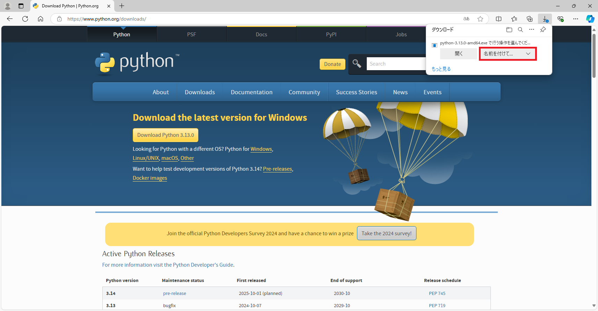

---
html:
  embed_local_images: true
  embed_svg: true
  offline: true
  toc: true
export_on_save:
  html: true
---

# template markdown

<!-- @import "[TOC]" {cmd="toc" depthFrom=1 depthTo=6 orderedList=false} -->

<!-- code_chunk_output -->

- [template markdown](#template-markdown)
  - [凡例](#凡例)
  - [pythonインストール](#pythonインストール)
    - [Pythonのバージョンについて](#pythonのバージョンについて)
    - [インストーラの入手](#インストーラの入手)
    - [インストーラの実行](#インストーラの実行)
    - [インストールできたことの確認](#インストールできたことの確認)
    - [インストールできたことの確認 その2](#インストールできたことの確認-その2)
  - [章立て](#章立て)

<!-- /code_chunk_output -->

## 凡例

本書内での記述例を示す。

:::tip
知っておくと便利な小技系
:::

:::info
知っておいた方がよさそうな情報
:::

:::note
おまけ的なメモ・自分語り
:::

:::warning
極めてリスクの高い事例
:::

:::caution
注意深く利用する必要のある事例
:::

:::sample
コマンドやコードのサンプル等
:::

## pythonインストール

以下順序でPythonのインストールを進める。  

1. 利用するバージョンについて
1. インストーラの入手
1. インストーラの実行
1. インストールできたことの確認

### Pythonのバージョンについて

Pythonには大まかに2.n系と3.n系が存在する。  
どちらを利用することもありうるが、本書では最新のPython環境を利用する。  
それぞれの主な特徴は下図の通り。  

:::info
Pythonには派生形が多数存在する。  
・Circuit Python  
・Micro Python  
・Iron Python  
・etc.  
これらと区別するためにPython.orgからダウンロードできるPythonをCPythonと呼称することもある。
:::

:::note
筆者が現在利用しているメイン機では2.7, 3.7～3.11をインストールしている。  
このため、利用するバージョンを使い分ける手段が必要になる。  
バージョンを使い分ける手段は後述する。  
:::

### インストーラの入手

以下Python.orgのページからインストーラをダウンロードする。  
[https://www.python.org/](https://www.python.org/)

Downloadsをクリックする。

{.image_w900}

トップには最新バージョンが表示されるハズなのでクリックする。

{.image_w900}

ブラウザのダウンローダに従って、名前を付けて保存する。

{.image_w900}

適当なフォルダへ保存する。  
下図は一例として「ダウンロード」フォルダへ、そのままのファイル名で保存している。  

{.image_w900}

### インストーラの実行

公式のインストール手順は以下にある。  
[https://docs.python.org/ja/3/using/windows.html](https://docs.python.org/ja/3/using/windows.html)

:::note
Pythonは敷居の低さゆえに粗製乱造されたネット記事が多いうえ、昨今は生成AIの影響で粗悪さに拍車がかかっている。  
困ったことがあれば最初に公式ドキュメントを参照すること。  
ただし、公式ドキュメントは厳密さゆえに分かり難いこともあるので、ネット記事と行ったり来たりしながら正解を考えることも多分にありうる。  
:::

ダウンロードしたインストーラをダブルクリックする。

{.image_w900}

「Add python.exe to PATH」のチェックボックスを有効にしてから、「Install Now」をクリックする。  

{.image_w900}

:::info
「Add python.exe to PATH」とは。  
Windowsの環境変数PATHにPythonのインストールディレクトリを追加することを意味する。  
環境変数PATHに追加されたプログラムは、どのディレクトリからでも、フルパスを指定せずに実行できるようになる。  
このチェックボックスを有効にすることで、以下が同義になる。
・コマンドプロンプト上で「python」と入力する
・コマンドプロンプト上で「Python.exe」のフルパスを入力する
:::

:::Caution
環境変数PATHとは。  
Windowsがプログラムを探す際のディレクトリパスが登録されている。  
今回のようにインストーラが追加してくれる場合もあれば、ユーザが能動的に追加することも出来る。  
環境変数PATHへ追加しておけば、フルパスを毎回入力する手間が省けるので、作業効率が上がる。  
**乱用は厳禁。**  
システム全体に影響するため、乱用すると環境同士が衝突しうる可能性がある。  
一般ユーザが編集することはあまり想定されておらず、問題が生じた場合の原因も特定しにくい。  
機能をよく理解したうえで、本当に必要なディレクトリのみ登録すること。  
:::

:::info
「Use admin privileges when installing py.exe」とは。  
py.exeというpythonを管理するランチャーのインストール時に管理者権限を利用するか否か。  
PC内の全ユーザへインストールする場合に、管理者権限が必要となる。  
今回は全ユーザへインストールしないので、チェックボックスを有効にしない。
:::

インストールが開始されるので、完了するまで数分待機する。  

{.image_w900}

インストール完了後、「Disable path length limit」が表示された場合はクリックする。  

{.image_w900}

:::info
「Disable path length limit」とは。  
※ Windows側の設定なので、過去に設定済みの場合は本オプションは表示されない。  
昔のWindowsは、パスの長さが260文字に制限されていたため、261文字以上のパスは解決できずエラーになる。  
今のWindowsは、約32,000文字まで制限を緩和でき、その設定を有効化するのが本オプションである。  
これにより、Pythonにおける open()や osモジュール等、パスを扱うほとんどの機能で260文字より長いパスを利用できるようになる。
:::

:::note
無効のままでもいいが、有効化しておくことを推奨する。  
雑にPythonスクリプトを組むと、実行環境までのパス＋ログファイル名で260文字を超える状況は容易に発生する。  
:::

「Disable path length limit」をクリックした場合、Windows側の設定を変更することになる。  
ユーザアカウント制御が表示されるので、「はい」をクリックする。  

{.image_w900}

上記設定の更新後、もしくは最初から「Disable path length limit」が表示されていない場合は、以下表示となる。  
「Close」を押下してインストール作業は終わり。  

{.image_w900}

### インストールできたことの確認

まず、コマンドプロンプトを起動する。  
Windowsキー と Rキー を同時押しすることで、「ファイル名を指定して実行」ウィンドウが表示される。  
「cmd」と入力して Enterキーを押下する。  

{.image_w900}

ホームディレクトリを表示した状態のコマンドプロンプトが起動する。  

{.image_w900}

「python」と入力して Enterキーを押下し、以下表示になればPythonのインストールに成功している。  

{.image_w900}

:::info
">>> "の待ち受け状態は、いわゆる対話モードを示す。
行単位で処理を実行できるので、ごく簡単な動作確認程度ならこの状態で試すことも可能。  
:::

試しに以下コマンド入力すれば`Hello World!`が出力され、問題なく動作することが分かる。  

:::sample
print('Hello World!')
:::

{.image_w900}

実行中は変数も保持するので、以下のような演算を行うことも可能である。  

:::sample
print('Hello World!')
:::

{.image_w900}

対話モードを終了するには以下コマンドを実行する。  

:::sample
quit()
:::

{.image_w900}

### インストールできたことの確認 その2

インストール手順の途中で登場した「py.exe」を利用することでもインストール状態の確認ができる。  
以下コマンドを利用すると、インストール済みのPythonを一覧表示できる。  
一覧に今回インストールしたバージョンが表示されれば、インストールに成功している。  

:::sample
py --list
:::

{.image_w900}

## 章立て

pythonインストール

VSCodeインストール

VSCodeの拡張機能インストール
  python debuggerを利用すること

  VSIXからとってくることもできるが、スペルミスには要注意  
  基本的に許可リストにあるライブラリのみ利用すること  

単純なスクリプトを実行して、挙動確認

パッケージ管理・Pythonバージョンについて

uv/pipenv環境について

JupyterNotebook環境の作成
  ライブラリの注意点
  PyPIからとってくることもできるが、スペルミスには要注意  
  基本的に許可リストにあるライブラリのみ利用すること  

セルで実行

markdownによる文書を作成したい場合は、この環境を利用する。  

- 推奨事項に追加してある拡張機能を有効化すること。
- 上記有効化してあれば、目次も自動更新される。
